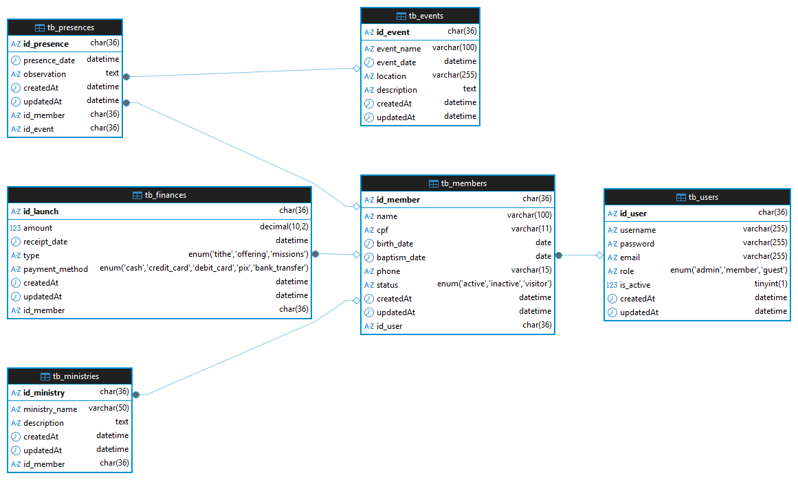

# 🏘️ Sistema de Gerenciamento de Igrejas

Projeto Final a ser utilizado como base para avaliação da Etapa 3 do componente curricular Programação Web II do curso de Tecnologia em Análise e Desenvolvimento de Sistemas do IFMA Coelho Neto

## 📋 Descrição

Sistema de gerenciamento para igrejas, desenvolvido com Node.js, Express e MySQL. Gerencia membros, ministérios, finanças, eventos e presença.

## 🚀 Tecnologias

- **Node.js** - Runtime JavaScript
- **Express** - Framework web
- **Sequelize** - ORM para Node.js
- **MySQL** - Banco de dados
- **Docker** - Containerização
- **JWT** - Autenticação

## 📦 Dependências

- `express` - Framework web
- `sequelize` - ORM
- `mysql2` - Driver MySQL
- `jsonwebtoken` - Autenticação JWT
- `bcryptjs` - Hash de senhas
- `cors` - Cross-Origin Resource Sharing
- `dotenv` - Variáveis de ambiente

## 🛠️ Instalação

### Pré-requisitos

- Node.js (v16+)
- Docker e Docker Compose
- MySQL 8.0

### Passos

1. **Clone o repositório**
   ```bash
   git clone https://github.com/sCube-dv/church-management.git
   cd church-management
   ```

2. **Instale as dependências**
   ```bash
   npm install
   ```

3. **Configure o ambiente**
   ```bash
   cp .env.example .env
   cp compose.example.yml compose.yml
   ```
   Edite os arquivos com suas credenciais. Importante: configure as credenciais do superusuário em `.env`:
   ```env
   SUPERUSER_EMAIL=seu-email@church.com
   SUPERUSER_USERNAME=seu-usuario
   SUPERUSER_PASSWORD=sua-senha-forte
   ```

4. **Inicie o banco de dados**
   ```bash
   docker compose up -d
   ```


5. **Sincronize o banco de dados**
   ```bash
   npm run db-sync
   ```
   Isso irá:
   - Criar as tabelas do banco de dados
   - Criar automaticamente o superusuário com as credenciais do `.env`

6. **(Opcional) Popular com dados de teste (apenas para desenvolvimento, arrumar depois)**
   ```bash
   npm run db-seed
   ```
   Isso irá popular o banco com:
   - 4 usuários de exemplo
   - 7 membros
   - 6 eventos
   - 6 ministérios
   - 10 lançamentos financeiros
   - 14 registros de presença

7. **Inicie a aplicação**
   ```bash
   npm start
   ```
   Para desenvolvimento com hot-reload:
   ```bash
   npm run dev
   ```

## 📚 Scripts Disponíveis

- `npm start` - Inicia o servidor
- `npm run dev` - Inicia em modo desenvolvimento com hot-reload (Node.js --watch)
- `npm run db-sync` - Sincroniza as tabelas do banco de dados e cria o superusuário
- `npm run db-seed` - Popula o banco de dados com dados de teste (executar após db-sync)
- `npm test` - Executa testes

## 🗄️ Estrutura do Projeto

```
src/
├── app.js           # Configuração do Express e middlewares
├── config/          # Configurações (banco de dados)
├── controllers/     # Controladores (lógica das rotas)
├── helpers/         # Funções auxiliares (sincronização BD)
├── middlewares/     # Middlewares Express (autenticação JWT)
├── models/          # Modelos Sequelize
├── routes/          # Rotas API
└── services/        # Serviços (lógica de negócio)
```

### Camadas da Arquitetura

- **app.js** - Configuração central do Express, middlewares globais e rotas
- **Services** - Contém a lógica de negócio (CRUD, validações)
- **Controllers** - Recebem requisições e chamam os services
- **Middlewares** - Autenticação JWT e validações de requisições
- **Models** - Definem a estrutura dos dados
- **Routes** - Definem os endpoints da API

## 📁 Arquivos de Configuração e Documentação

### Configuração
```
compose.yml         # Configuração Docker (não versionada)
compose.example.yml # Exemplo de configuração Docker
.env               # Variáveis de ambiente (não versionada)
.env.example       # Exemplo de variáveis de ambiente
server.js          # Ponto de entrada da aplicação
```

### Documentação
```
README.md                        # Documentação principal
database_data_insert_guide.md    # Guia de inserção de dados no BD
relationships.md                 # Relacionamentos entre tabelas
TODO.md                          # Tarefas e planejamento
```

### Dados de Teste
```
insert-test-data.sql            # Script SQL com dados de exemplo
api_routes_test_files/          # Pasta com exemplos de requisições HTTP (.http)
```

## � Variáveis de Ambiente

O arquivo `.env` deve conter as seguintes variáveis:

### Banco de Dados
```env
DB_NAME=church_db           # Nome do banco de dados
DB_USER=root                # Usuário do MySQL
DB_PASSWORD=root            # Senha do MySQL
DB_HOST=localhost           # Host do banco de dados
DB_DIALECT=mysql            # Dialeto do Sequelize
DB_PORT=3306                # Porta do MySQL
```

### Aplicação
```env
APP_PORT=3000               # Porta do servidor Express
JWT_SECRET=seu-secret-key   # Chave secreta para JWT (use uma chave forte!)
```

### Superusuário
```env
SUPERUSER_EMAIL=admin@church.com    # Email do superusuário
SUPERUSER_USERNAME=admin            # Username do superusuário
SUPERUSER_PASSWORD=senha-forte      # Senha do superusuário (mude em produção!)
```

**⚠️ Importante:** Nunca versione o arquivo `.env` com credenciais reais. Use o `.env.example` como template.


## 📖 Modelos de Dados

- **User** - Usuários do sistema (admin, member, guest) com autenticação
- **Member** - Membros da igreja
- **Ministry** - Ministérios
- **Finance** - Finanças
- **Event** - Eventos
- **Presence** - Presença em eventos

### Relacionamentos

```
User (1) ──→ (N) Member
Member (1) ──→ (N) Finance
Member (1) ──→ (N) Ministry
Member (N) ←→ (N) Event (via Presence)
```

### Diagrama do Banco de Dados (DER)



Para mais detalhes sobre os relacionamentos, consulte **[`relationships.md`](relationships.md)** e **[`database_data_insert_guide.md`](database_data_insert_guide.md)**

## 🔌 API Endpoints

### Autenticação

| Método | Endpoint | Descrição | Autenticação |
|--------|----------|-----------|--------------|
| POST | `/api/users/login` | Login de usuário | Não |

**Exemplo de Login:**
```json
POST /api/users/login
{
  "email": "admin@church.com",
  "password": "sua-senha"
}
```

**Resposta:**
```json
{
  "message": "Login realizado com sucesso!",
  "token": "eyJhbGciOiJIUzI1NiIsInR5cCI6IkpXVCJ9...",
  "user": {
    "id_user": "uuid",
    "username": "admin",
    "email": "admin@church.com",
    "role": "admin"
  }
}
```

### Usuários

| Método | Endpoint | Descrição | Autenticação |
|--------|----------|-----------|--------------|
| POST | `/api/users/create` | Criar novo usuário | **Sim** (JWT) |
| GET | `/api/users/get-all` | Listar todos os usuários | **Sim** (JWT) |
| GET | `/api/users/get/:id` | Buscar usuário por ID | **Sim** (JWT) |
| PUT | `/api/users/update/:id` | Atualizar usuário | **Sim** (JWT) |
| DELETE | `/api/users/delete/:id` | Deletar usuário (soft delete) | **Sim** (JWT) |
| PATCH | `/api/users/activate/:id` | Ativar usuário | **Sim** (JWT) |
| DELETE | `/api/users/delete/:id/hard` | Deletar usuário permanentemente | **Sim** (JWT) |

### Membros

| Método | Endpoint | Descrição | Autenticação |
|--------|----------|-----------|--------------|
| POST | `/api/members/create` | Criar novo membro | **Sim** (JWT) |
| GET | `/api/members/get-all` | Listar todos os membros | **Sim** (JWT) |
| GET | `/api/members/role/:role` | Listar membros por perfil de usuário (role) | **Sim** (JWT) |
| GET | `/api/members/ministry/:id` | Listar membros por ministério | **Sim** (JWT) |
| GET | `/api/members/finance/type/:type` | Listar membros por tipo de contribuição financeira | **Sim** (JWT) |
| GET | `/api/members/event/:id` | Listar membros por presença em evento | **Sim** (JWT) |
| GET | `/api/members/get/:id` | Buscar membro por ID | **Sim** (JWT) |
| PUT | `/api/members/update/:id` | Atualizar membro | **Sim** (JWT) |
| DELETE | `/api/members/delete/:id` | Deletar membro (soft delete) | **Sim** (JWT) |
| PATCH | `/api/members/activate/:id` | Ativar membro | **Sim** (JWT) |
| DELETE | `/api/members/delete/:id/hard` | Deletar membro permanentemente | **Sim** (JWT) |

### Eventos

| Método | Endpoint | Descrição | Autenticação |
|--------|----------|-----------|--------------|
| POST | `/api/events/create` | Criar novo evento | **Sim** (JWT) |
| GET | `/api/events/get-all` | Listar todos os eventos | Não |
| GET | `/api/events/get/:id` | Buscar evento por ID | Não |
| PUT | `/api/events/update/:id` | Atualizar evento | **Sim** (JWT) |
| DELETE | `/api/events/delete/:id` | Deletar evento (soft delete) | **Sim** (JWT) |
| PATCH | `/api/events/activate/:id` | Ativar evento | **Sim** (JWT) |
| DELETE | `/api/events/delete/:id/hard` | Deletar evento permanentemente | **Sim** (JWT) |

### Ministérios

| Método | Endpoint | Descrição | Autenticação |
|--------|----------|-----------|--------------|
| POST | `/api/ministries/create` | Criar novo ministério | **Sim** (JWT) |
| GET | `/api/ministries/get-all` | Listar todos os ministérios | Não |
| GET | `/api/ministries/get/:id` | Buscar ministério por ID | Não |
| PUT | `/api/ministries/update/:id` | Atualizar ministério | Não |
| DELETE | `/api/ministries/delete/:id` | Deletar ministério (soft delete) | **Sim** (JWT) |
| PATCH | `/api/ministries/activate/:id` | Ativar ministério | **Sim** (JWT) |
| DELETE | `/api/ministries/delete/:id/hard` | Deletar ministério permanentemente | **Sim** (JWT) |

### Finanças

| Método | Endpoint | Descrição | Autenticação |
|--------|----------|-----------|--------------|
| POST | `/api/finances/create` | Criar novo lançamento | **Sim** (JWT) |
| GET | `/api/finances/get-all` | Listar todos os lançamentos | **Sim** (JWT) |
| GET | `/api/finances/get/:id` | Buscar lançamento por ID | **Sim** (JWT) |
| PUT | `/api/finances/update/:id` | Atualizar lançamento | **Sim** (JWT) |
| DELETE | `/api/finances/delete/:id` | Deletar lançamento (soft delete) | **Sim** (JWT) |
| PATCH | `/api/finances/activate/:id` | Ativar lançamento | **Sim** (JWT) |
| DELETE | `/api/finances/delete/:id/hard` | Deletar lançamento permanentemente | **Sim** (JWT) |

### Presença

| Método | Endpoint | Descrição | Autenticação |
|--------|----------|-----------|--------------|
| POST | `/api/presences/create` | Registrar presença | **Sim** (JWT) |
| GET | `/api/presences/get-all` | Listar todas as presenças | **Sim** (JWT) |
| GET | `/api/presences/get/:id` | Buscar presença por ID | **Sim** (JWT) |
| PUT | `/api/presences/update/:id` | Atualizar presença | **Sim** (JWT) |
| DELETE | `/api/presences/delete/:id` | Deletar presença (soft delete) | **Sim** (JWT) |
| PATCH | `/api/presences/activate/:id` | Ativar presença | **Sim** (JWT) |
| DELETE | `/api/presences/delete/:id/hard` | Deletar presença permanentemente | **Sim** (JWT) |

**Nota:** Para rotas protegidas, inclua o token JWT no header:
```
Authorization: Bearer seu-token-jwt
```

### 🧪 Testando a API

O projeto inclui uma pasta `api_routes_test_files/` com exemplos de requisições para testar todos os endpoints. Você pode usar extensões como:

- **REST Client** (VS Code)
- **Thunder Client** (VS Code)
- **Postman**
- **Insomnia**

Exemplo de uso com REST Client:
1. Navegue até a pasta `api_routes_test_files/`
2. Abra um dos arquivos (ex: `users.http` ou `member.http`)
3. Clique em "Send Request" acima de cada requisição
4. Visualize a resposta no painel lateral


## 🗃️ Dados de Teste

O projeto inclui recursos completos para popular o banco de dados com dados de exemplo:

### 📄 Arquivos Disponíveis

- **[`insert-test-data.sql`](insert-test-data.sql)** - Script SQL pronto para uso com dados de exemplo
  - 4 usuários (admin, members, guest)
  - 7 membros com diferentes status
  - 6 eventos (cultos, EBD, retiro)
  - 6 ministérios
  - 10 lançamentos financeiros
  - 14 registros de presença

- **[`database_data_insert_guide.md`](database_data_insert_guide.md)** - Guia completo de inserção de dados
  - Ordem correta de povoamento das tabelas
  - Explicação de dependências entre tabelas
  - Exemplos práticos com SQL
  - Troubleshooting de erros comuns
  - Boas práticas de segurança

### 🚀 Como Usar

Existem duas formas de popular o banco:

#### Opção A: Via Node.js (Recomendado)
Sincronize o banco e execute o seed:
```bash
npm run db-sync
npm run db-seed
```

#### Opção B: Via SQL Manual
Execute o script SQL diretamente no container:
```bash
docker exec mysql_api_church_mngt mysql -u dev -pdev@123 db_church_mngt < insert-test-data.sql
```

3. **Consulte o guia** para entender a estrutura e criar seus próprios dados:
   - [Guia de Inserção de Dados](database_data_insert_guide.md)


## 🔒 Segurança

- Senhas hasheadas com **bcryptjs**
- Autenticação via **JWT** (JSON Web Tokens)
- Middleware de autenticação protegendo rotas sensíveis
- Variáveis sensíveis em `.env` (não versionadas)
- `compose.yml` no `.gitignore`
- Validação de email em usuários
- Sistema de roles (admin, member, guest)
- Superusuário criado automaticamente na sincronização do BD
- CORS habilitado para requisições cross-origin

## � Documentação Adicional

Para informações mais detalhadas sobre aspectos específicos do projeto, consulte:

| Documento | Descrição |
|-----------|-----------|
| [📊 Guia de Inserção de Dados](database_data_insert_guide.md) | Ordem correta de povoamento, dependências e exemplos SQL |
| [🔗 Relacionamentos](relationships.md) | Detalhes sobre relacionamentos entre tabelas do banco |
| [📋 TODO](TODO.md) | Lista de tarefas, melhorias planejadas e roadmap |
| [🧪 Testes HTTP](api_routes_test_files/) | Exemplos de requisições para testar a API |
| [💾 Dados de Teste](insert-test-data.sql) | Script SQL com dados de exemplo prontos para uso |

## �📝 Licença

MIT - Veja o arquivo [LICENSE](LICENSE) para mais detalhes

## 👤 Autor

Samuel Santos

## 📞 Suporte

Para reportar bugs ou sugerir features, abra uma [issue](https://github.com/sCube-dv/church-management/issues)
